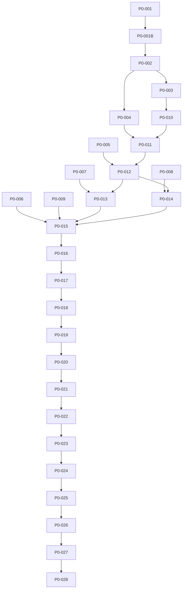

# Kivo Video Ultimate - P0 Ticket Index

本文档列出了 Kivo Video Ultimate 项目的所有 P0 级别 ticket（P0-001 到 P0-028）。

## P0 路线图概览

P0 路线是**后端播放核心路线**，不是商业 UI 路线。本仓库只做自研播放核心地基，不接真实 FFmpeg/D3D11/WASAPI/libmpv/Qt/UI。

**核心原则**:
- 自研大脑，不是 mpv shell
- 分层清晰，边界干净
- 状态确定，错误可解释
- 能力可验证，接入可替换
- 输出可诊断，长期可商业化

---

## Ticket 列表

| Ticket | 名称 | 状态 | 说明 |
|--------|------|------|------|
| [P0-001](#p0-001) | Playback Core Foundation (Core Brain) | ✅ PASS_COMMITTED | 播放核心地基：Command, Event, Error, StateMachine, Engine |
| [P0-001B](#p0-001b) | Playback Core North Star | 🔄 IN_PROGRESS | 播放核心北极星方向文档 |
| [P0-002](#p0-002) | Pipeline Contracts | ⏳ PENDING | Pipeline 合同层：probe/demux/stream/packet/queue/flush/drain/seek/cancellation |
| [P0-003](#p0-003) | Media Probe Model | ⏳ PENDING | Media Probe 模型 |
| [P0-004](#p0-004) | Packet Flow Contracts | ⏳ PENDING | Packet Flow 合同：packet/queue/discontinuity/EOS/serial generation |
| [P0-005](#p0-005) | Decode Contracts | ⏳ PENDING | Decode 合同：video/audio/subtitle frame/sample/decode/flush/drain/reconfigure |
| [P0-006](#p0-006) | Clock And A/V Sync Contracts | ⏳ PENDING | Clock/Sync 合同：clock/drift/sync/correction/drop policy |
| [P0-007](#p0-007) | Video Output Contracts | ⏳ PENDING | Video Output 合同：surface/present/color metadata（不接 D3D11） |
| [P0-008](#p0-008) | Audio Output Contracts | ⏳ PENDING | Audio Output 合同：device/format/buffer/latency/underrun/passthrough（不接 WASAPI） |
| [P0-009](#p0-009) | Subtitle Contracts | ⏳ PENDING | Subtitle 合同：text/bitmap/timing/style/overlay（不实现渲染） |
| [P0-010](#p0-010) | FFmpeg Probe Adapter | ⏳ PENDING | FFmpeg Probe Adapter（真实 FFmpeg 接入开始） |
| [P0-011](#p0-011) | FFmpeg Demux Adapter | ⏳ PENDING | FFmpeg Demux Adapter |
| [P0-012](#p0-012) | FFmpeg Decode Adapter | ⏳ PENDING | FFmpeg Decode Adapter |
| [P0-013](#p0-013) | D3D11 Video Output Adapter | ⏳ PENDING | D3D11 Video Output Adapter |
| [P0-014](#p0-014) | WASAPI Audio Output Adapter | ⏳ PENDING | WASAPI Audio Output Adapter |
| [P0-015](#p0-015) | A/V Sync Integration | ⏳ PENDING | A/V Sync 集成 |
| [P0-016](#p0-016) | HDR / Color Pipeline | ⏳ PENDING | HDR / Color Pipeline |
| [P0-017](#p0-017) | Advanced Audio | ⏳ PENDING | Advanced Audio |
| [P0-018](#p0-018) | Player Quality Gates | ⏳ PENDING | Player Quality Gates |
| [P0-019](#p0-019) | Playback Diagnostics / Trace Contracts | ⏳ PENDING | Playback Diagnostics / Trace 合同 |
| [P0-020](#p0-020) | Format Compatibility Matrix / Sample Corpus Gate | ⏳ PENDING | Format 兼容性矩阵 / 样本语料库门禁 |
| [P0-021](#p0-021) | Performance / Resource Budget Gates | ⏳ PENDING | 性能 / 资源预算门禁 |
| [P0-022](#p0-022) | Fault Tolerance / Bad Media Hardening | ⏳ PENDING | 容错 / 坏媒体加固 |
| [P0-023](#p0-023) | Persistent Playback Core State | ⏳ PENDING | 持久化播放核心状态 |
| [P0-024](#p0-024) | Release Quality / Soak / Stress Gates | ⏳ PENDING | 发布质量 / 浸泡 / 压力门禁 |
| [P0-025](#p0-025) | Legal / Codec / DRM Boundary Planning | ⏳ PENDING | 法律 / 编解码器 / DRM 边界规划 |
| [P0-026](#p0-026) | Hardware Decode / Zero-Copy Boundary Planning | ⏳ PENDING | 硬件解码 / 零拷贝边界规划 |
| [P0-027](#p0-027) | Renderer Quality / Scaling / Frame Pacing Policy | ⏳ PENDING | 渲染器质量 / 缩放 / 帧 pacing 策略 |
| [P0-028](#p0-028) | Device Capability Runtime Matrix | ⏳ PENDING | 设备能力运行时矩阵 |

---

## Ticket 详情

### P0-001: Playback Core Foundation (Core Brain)

**状态**: ✅ PASS_COMMITTED  
**分支**: `kivo-playback-core-foundation-p0-001`  
**HEAD**: `f234c0e`  
**目标**: 建立 playback core contracts, state machines, commands, events, and error models  
**范围**:
- `src/core/command/` - PlaybackCommand
- `src/core/event/` - PlaybackEvent
- `src/core/error/` - PlaybackError
- `src/core/state/` - PlaybackStateMachine
- `src/core/engine/` - PlaybackEngine
- `src/core/session/` - PlaybackSession
- `src/core/manager/` - PlaybackManager (协调层)
- `src/core/id/` - PlaybackId
- `src/core/time/` - PlaybackTime
- `src/core/result/` - PlaybackResult
- `src/core/clock/` - PlaybackClock (stub)
- `src/core/timeline/` - PlaybackTimeline (stub)
- `src/core/capability/` - PlaybackCapability (stub)

**验收**: 4/4 tests PASS, all governance checks PASS

---

### P0-001B: Playback Core North Star

**状态**: 🔄 IN_PROGRESS  
**目标**: 为 Kivo Video 后端播放核心写入"最强播放核心总方向"  
**范围**: 只写方向文档，不实现代码  
**输出**:
- `docs/24-playback-core-north-star.md` - 北极星方向文档
- `README.md` - 更新项目 README
- `docs/README.md` - 更新文档索引
- `docs/20-ticket-index.md` - 创建 ticket 索引

**禁止**:
- 实现代码
- 改 CMake
- 接 FFmpeg / D3D11 / WASAPI / libmpv / Qt / UI
- 继续 P0-002

---

### P0-002: Pipeline Contracts

**状态**: ⏳ PENDING (等待 P0-001B 完成)  
**目标**: 建立 probe / demux / stream / packet / queue / flush / drain / seek / cancellation 的 Pipeline 合同族  
**范围**:
- `src/pipeline/contracts/` - Pipeline 合同层
- 不接 FFmpeg
- 不接真实 demux
- 不接 decode
- 不接 output

**允许**:
- Pipeline 合同定义
- Pipeline 状态机
- Pipeline 命令/事件/错误模型

**禁止**:
- FFmpeg 类型
- 真实文件 IO
- 真实网络 IO
- 线程实现（P0-002 只做合同）

---

### P0-003: Media Probe Model

**状态**: ⏳ PENDING  
**目标**: 建立 Media Probe 模型  
**范围**:
- Media probe 结果模型
- Stream info 模型
- Codec info 模型
- Container info 模型

**禁止**: 接真实 FFmpeg probe

---

### P0-004: Packet Flow Contracts

**状态**: ⏳ PENDING  
**目标**: 建立 packet / queue / discontinuity / EOS / serial generation 合同  
**范围**:
- Packet 模型
- Packet queue 合同
- Discontinuity 处理
- EOS (End of Stream) 处理
- Serial generation 保护

**禁止**: 接真实 demux

---

### P0-005: Decode Contracts

**状态**: ⏳ PENDING  
**目标**: 建立 video/audio/subtitle frame/sample/decode/flush/drain/reconfigure 合同  
**范围**:
- Decode 命令/事件/错误模型
- Video frame 模型
- Audio sample 模型
- Subtitle sample 模型
- Flush/drain 合同
- Reconfigure 合同

**禁止**: 接真实 decoder

---

### P0-006: Clock And A/V Sync Contracts

**状态**: ⏳ PENDING  
**目标**: 建立 clock / drift / sync / correction / drop policy 合同  
**范围**:
- Clock 层次模型
- A/V sync 策略合同
- Drift detection 合同
- Correction policy 合同
- Drop policy 合同

**禁止**: 接真实 output

---

### P0-007: Video Output Contracts

**状态**: ⏳ PENDING  
**目标**: 建立 video output / surface / present / color metadata 合同  
**范围**:
- Video output 合同
- Surface 抽象
- Present 合同
- Color metadata 合同
- HDR metadata placeholder

**禁止**: 接 D3D11

---

### P0-008: Audio Output Contracts

**状态**: ⏳ PENDING  
**目标**: 建立 audio output / device / format / buffer / latency / underrun / passthrough 合同  
**范围**:
- Audio output 合同
- Device 抽象
- Audio format 模型
- Buffer 模型
- Latency 模型
- Underrun 模型
- Passthrough placeholder

**禁止**: 接 WASAPI

---

### P0-009: Subtitle Contracts

**状态**: ⏳ PENDING  
**目标**: 建立 subtitle text / bitmap / timing / style / overlay 合同  
**范围**:
- Subtitle text 模型
- Subtitle bitmap 模型
- Subtitle timing 模型
- Subtitle style 模型
- Overlay 合同

**禁止**: 实现渲染

---

### P0-010: FFmpeg Probe Adapter

**状态**: ⏳ PENDING  
**目标**: 接入真实 FFmpeg probe  
**范围**:
- FFmpeg probe adapter 实现
- 真实文件/网络 probe

**前提**: P0-002, P0-003 完成

---

### P0-011: FFmpeg Demux Adapter

**状态**: ⏳ PENDING  
**目标**: 接入真实 FFmpeg demux  
**范围**:
- FFmpeg demux adapter 实现
- 真实 packet 读取

**前提**: P0-004, P0-010 完成

---

### P0-012: FFmpeg Decode Adapter

**状态**: ⏳ PENDING  
**目标**: 接入真实 FFmpeg decode  
**范围**:
- FFmpeg decode adapter 实现
- 真实 video/audio decode

**前提**: P0-005, P0-011 完成

---

### P0-013: D3D11 Video Output Adapter

**状态**: ⏳ PENDING  
**目标**: 接入真实 D3D11 video output  
**范围**:
- D3D11 video output adapter 实现
- 真实 surface present

**前提**: P0-007, P0-012 完成

---

### P0-014: WASAPI Audio Output Adapter

**状态**: ⏳ PENDING  
**目标**: 接入真实 WASAPI audio output  
**范围**:
- WASAPI audio output adapter 实现
- 真实 audio render

**前提**: P0-008, P0-012 完成

---

### P0-015 to P0-028

**状态**: ⏳ PENDING  
**说明**: 后续 ticket 详细描述待补充  

**前提**: P0-001 到 P0-014 完成

---

## 状态说明

| 状态 | 说明 |
|------|------|
| ✅ PASS_COMMITTED | 已通过验收，已提交本地 commit |
| 🔄 IN_PROGRESS | 进行中 |
| ⏳ PENDING | 待开始（等待前置任务完成） |
| ❌ STOP | 已停止（遇到问题） |
| 🔄 BLOCKED | 被阻塞（等待外部依赖） |

---

## 依赖关系

---

**文档状态**: ACTIVE  
**最后更新**: 2026-06-10  
**维护者**: Kivo Team
